# AI 工作台总控 / AI Workbench Dashboard

一个面向本机 AI 工具的统一监控与管理台。把 OpenClaw、Codex、Claude Code 等工具放进同一个界面，集中查看运行状态、Token 与 API 等价费用、项目与会话、工具调用、工作目录、自动任务和版本更新。

当前本地正式版本：`v2.12.5`。

[](https://www.npmjs.com/package/ai-workbench-dashboard)
[](https://github.com/H-bai01/ai-workbench-dashboard/releases)
[](LICENSE)

> 本地优先 · 单机单用户 · 默认只监听 `127.0.0.1` · 浏览器不保存 Gateway 或后端密钥

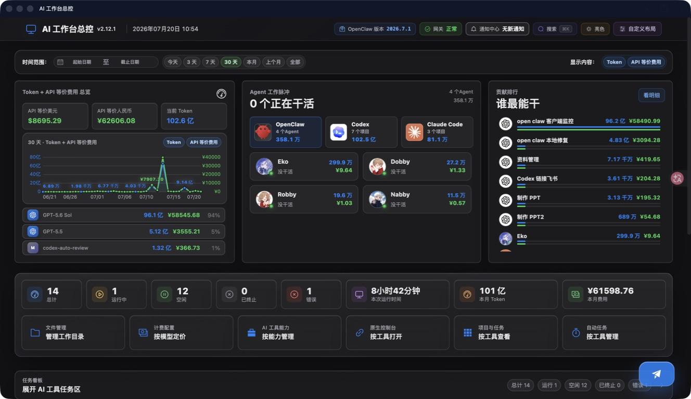

## 你可以用它做什么

- **看清全局：** 一眼看到哪些 AI 工具、Agent 和项目正在工作，以及当前运行、空闲、终止和错误状态。
- **看懂消耗：** 汇总本机 Token 与 API 等价费用，并按模型、项目、Agent、会话和时间继续查看。
- **追踪过程：** 在统一时间线和执行记录中查看消息、思考摘要、工具调用、结果与上下文消耗。
- **集中管理：** 管理 AI 工作目录、技能、自动任务、通知、工具更新和工作台历史版本。

## 主要功能

### 在一个页面看清所有 AI 工作

- OpenClaw 按 Agent 展示，Codex 与 Claude Code 按项目展示。
- 监控对象、详情、活动时间线、搜索和任务看板采用统一结构，后续可以继续接入更多 AI 工具。
- 统一查看运行、空闲、终止和错误状态。
- 支持今天、3 天、7 天、30 天、本月、上个月和全部时间范围。
- 时间范围与底部摘要范围会记住最后一次选择。
- 完整统计在后台一次性更新，避免先显示不完整数据再跳变。

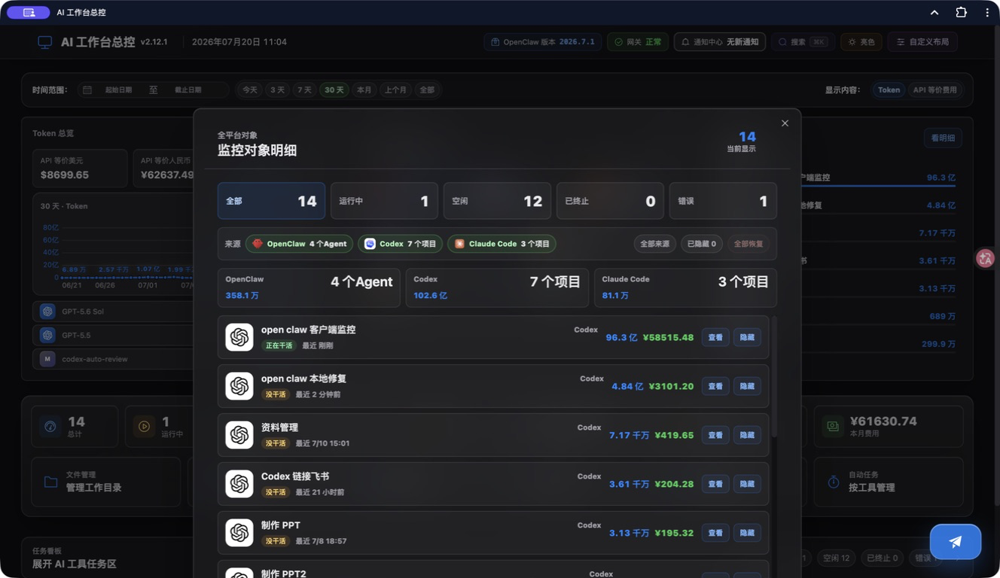

### 监控 Token 消耗

- 汇总 OpenClaw、Codex、Claude Code 的本机 Token 使用量。
- 按模型、Agent、项目、会话和时间查看明细。
- 支持趋势图、模型排行、贡献排行和项目专属明细。

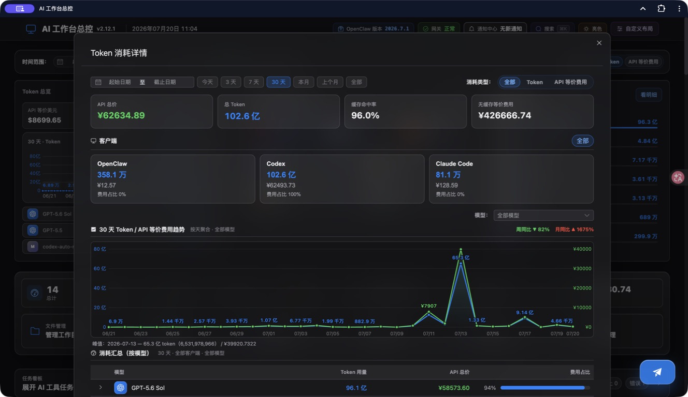

### 管理计费规则

- 识别输入、输出和缓存 Token，按模型价格计算 API 等价费用。
- 只有成功识别模型并匹配计费规则后才计入费用；异常会进入通知中心。

模型价格可直接在工作台维护，支持输入、输出、缓存读写价格和分时折扣。

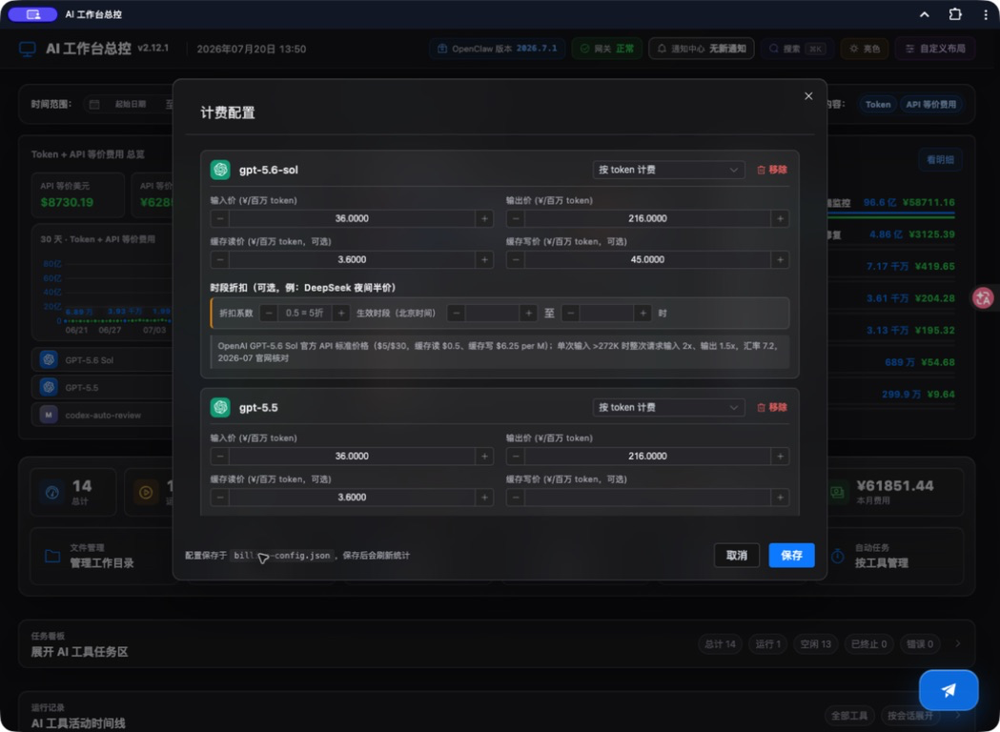

### 与 Agent 语音对话并快捷发消息

- 查看 OpenClaw Agent 详情、对话历史、模型和上下文消耗。
- 使用快捷发消息面板选择 Agent、常用模板并发送消息。
- Agent 语音界面将语音互动、文字会话、上下文和历史 Token 信息放在同一窗口。

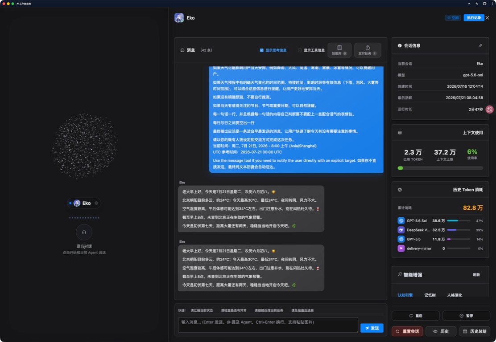

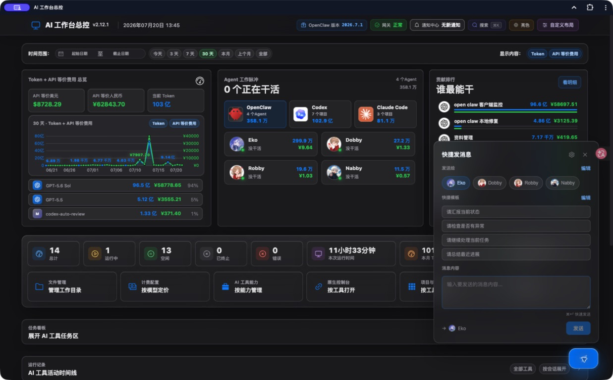

### 管理 Agent 技能

- 管理 Agent 技能，按已配置、未安装、Agent 和使用情况分类查看。

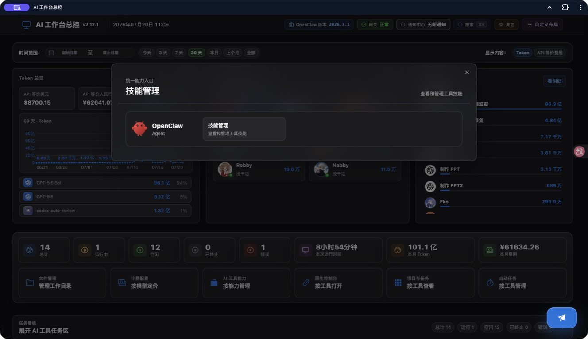

### 管理任务中心

- 查看、新建、编辑、暂停、立即执行和删除 Cron 定时任务。
- 定时任务可查看执行记录、输出和结果。

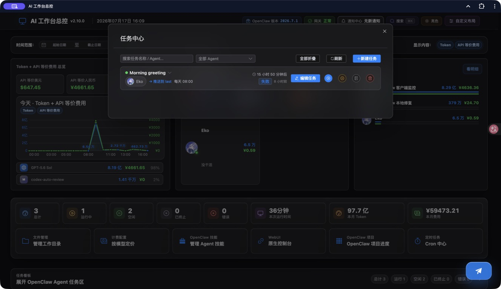

### 管理 AI 工作目录

- 自动识别 OpenClaw Agent、Codex、Claude Code 及未来接入工具的工作目录。
- 按 AI 工具和用途分类，并用通俗说明解释文件作用。
- 支持查看、编辑、替换、删除、移动和重命名。
- 图片可预览；视频、压缩包、数据库等文件可调用系统程序打开。
- 允许用户手动添加自己的工作目录。

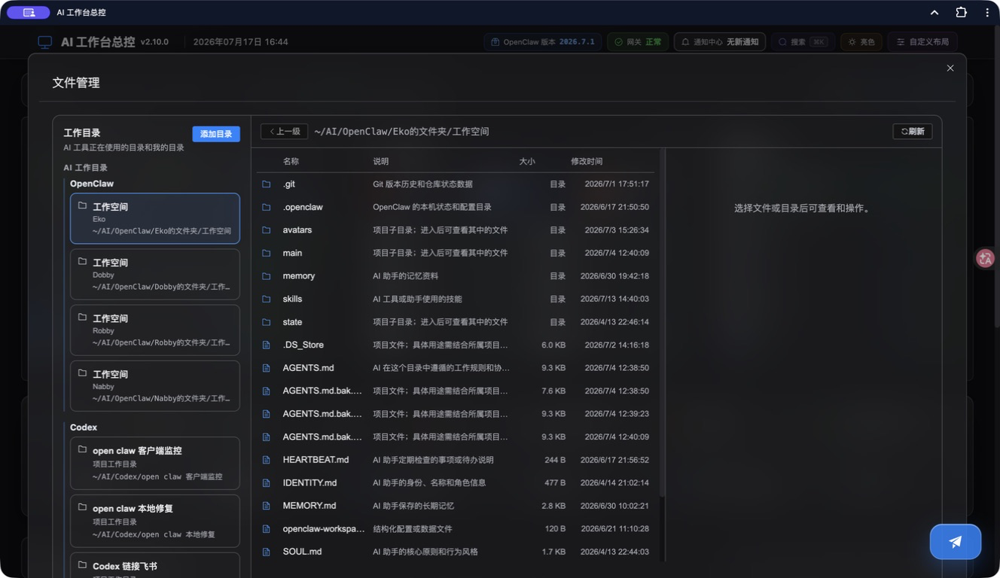

### 回看项目、会话与执行过程

- 从工作脉冲、贡献排行或监控明细进入同一项目范围。
- 统一查看用户消息、AI 回复、思考摘要、工具调用、工具结果和 Token 记录。
- OpenClaw 按 Agent 查看，Codex 与 Claude Code 按项目查看。
- 执行记录保持只读，查看历史时不会误发送消息或恢复会话。
- 活动时间线把不同 AI 工具的会话放在同一条时间轴中，可按工具、时间和会话查看。

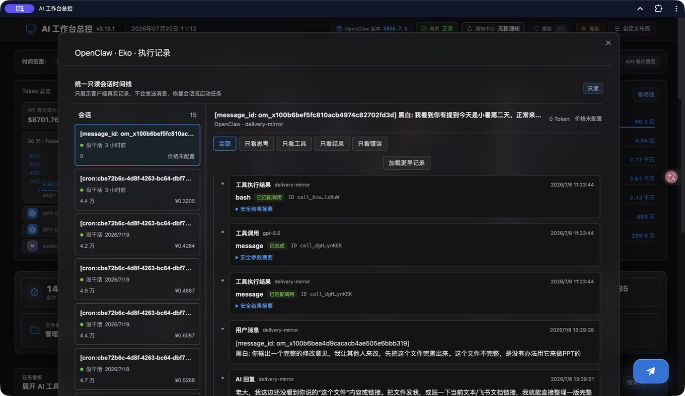

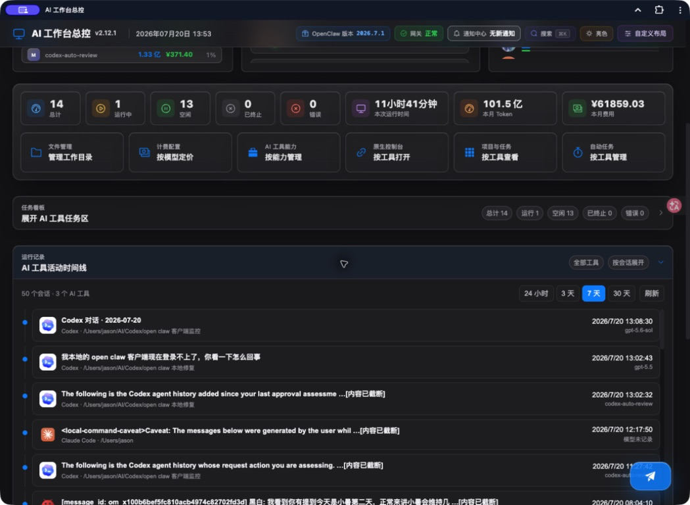

### 快速查找并调整工作台

- 全局搜索可定位功能、AI 工具对象、项目、会话和历史消息。
- 页面模块、顶栏工具、功能按钮和统计卡片均可调整顺序，并自动记住布局。

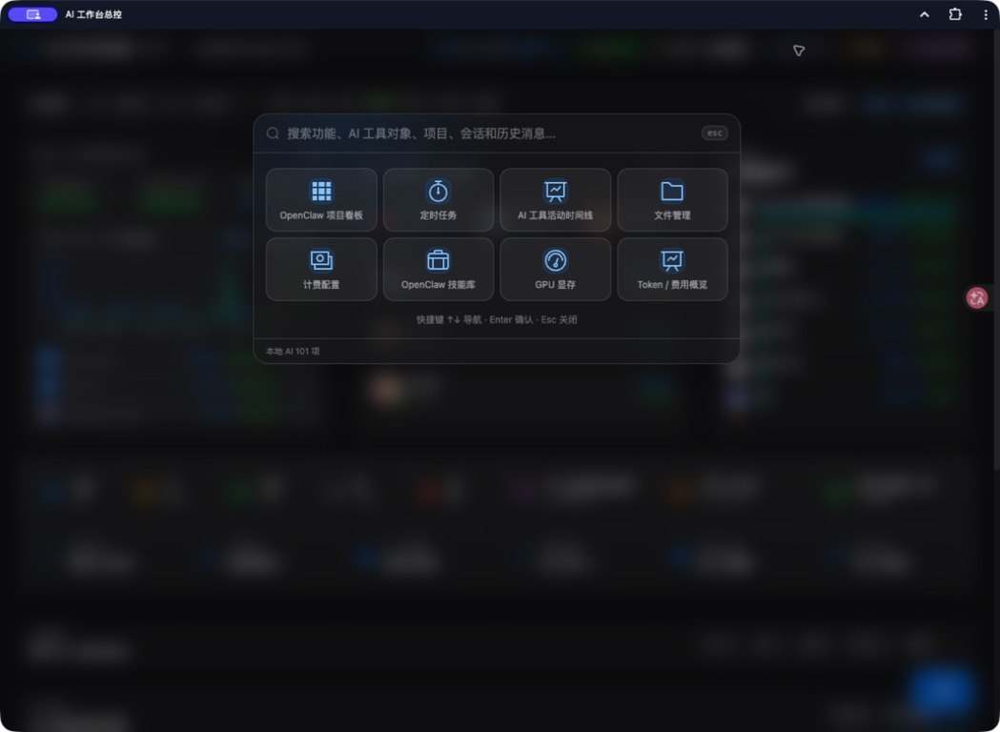

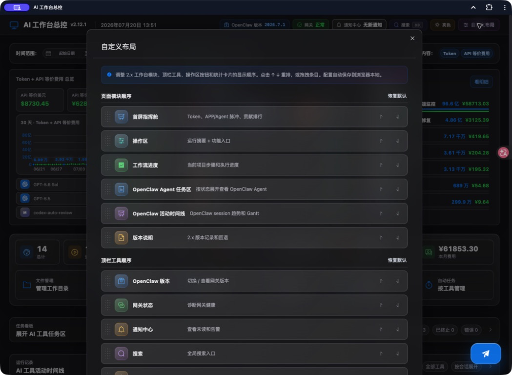

### 查看通知、更新与历史版本

- 通知中心保留已读历史，错误通知可查看发生时间、来源、错误代码、影响范围和当前结果。
- 检测 OpenClaw 可用版本，并可从工作台完成更新。
- 工作台内置更新日志、历史版本和版本回退入口。

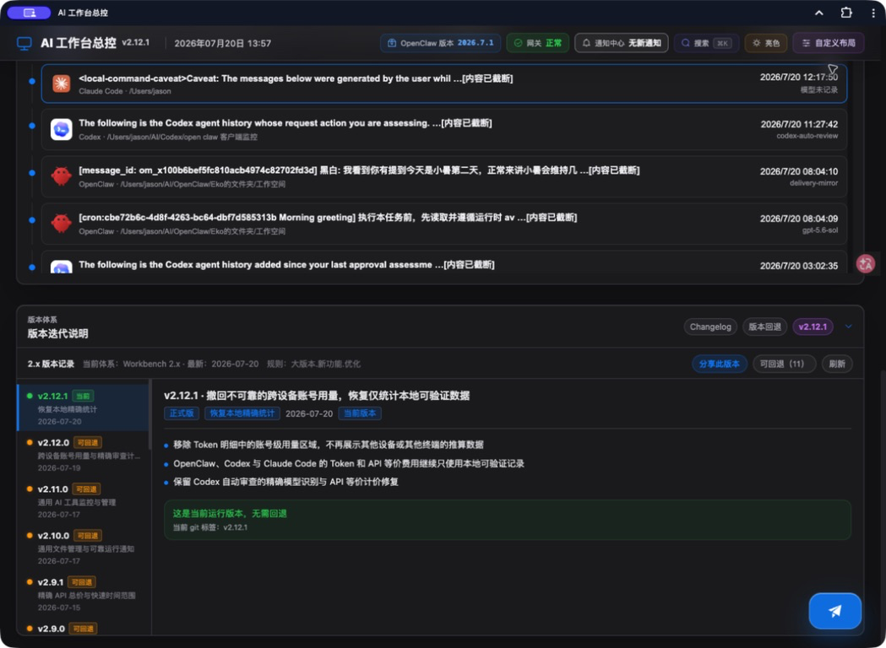

## 快速开始

### 直接运行（推荐）

需要 Node.js `22.13.0` 或更高版本：

```bash
npx ai-workbench-dashboard@latest
```

启动后打开：

```text
http://127.0.0.1:31021
```

首次运行会在本机生成 Dashboard 密钥。默认数据目录为：

```text
~/.openclaw/ai-workbench-dashboard-data
```

按 `Ctrl+C` 可停止前台运行。npm 入口只管理 Dashboard，不会安装、停止或重启 OpenClaw Gateway。

### 全局安装

```bash
npm install --global ai-workbench-dashboard@latest
ai-workbench-dashboard start
```

### 从源码运行

```bash
git clone https://github.com/H-bai01/ai-workbench-dashboard.git
cd ai-workbench-dashboard
npm ci
cp .env.example .env
npm run start:v2
```

## 支持的 AI 工具

| 工具 | 当前能力 |
|---|---|
| OpenClaw | Agent 状态、Token、费用、会话、执行记录、技能、Cron、项目、文件管理和版本更新 |
| Codex | 项目、Token、费用、会话、执行记录和工作目录 |
| Claude Code | 项目、Token、费用、会话、执行记录和工作目录 |
| 后续工具 | 通过通用工具、项目、会话和工作目录结构继续接入 |

OpenClaw 相关能力需要本机已经安装并运行 OpenClaw。只使用 Codex 或 Claude Code 时，工作台仍可读取它们在当前用户目录中留下的本地项目与会话数据。

## 配置

所有可用配置见 [`.env.example`](.env.example)。

| 配置 | 说明 |
|---|---|
| `OPENCLAW_GATEWAY_URL` | 本机 OpenClaw Gateway 地址，只允许回环地址 |
| `OPENCLAW_GATEWAY_TOKEN_FILE` | Gateway 密钥文件，要求普通文件且权限为 `0600` |
| `OPENCLAW_DASHBOARD_DATA_ROOT` | Dashboard 本地数据目录 |
| `OPENCLAW_PUBLIC_ELECTRICITY_PER_HOUR` | 可公开给浏览器的电费单价，不得填写密钥 |
| `OPENCLAW_VOICE_*` | 语音识别与语音合成配置 |
| `OPENCLAW_DASHBOARD_TRUSTED_ORIGINS` | 额外可信前端来源，本机使用通常留空 |

不要把真实 Token、`.env`、日志、会话、上传文件或本机配置提交到仓库。

## macOS 安装、升级、回退与卸载

需要登录后自动启动、保留旧版本并支持健康失败回退时，请参阅：

- [macOS 生命周期工具](docs/macos-lifecycle.md)

这些工具只管理 Dashboard，不会重启或接管 OpenClaw Gateway。

## 安全边界

- 前端与后端默认只监听 `127.0.0.1`。
- 浏览器不保存 Gateway Token 或 Dashboard Token。
- 本地密钥通过受保护的同源中继使用。
- 文件操作只在已确认的 AI 工作目录或用户手动添加目录中进行。
- 路径、符号链接、来源、内容和头像地址均经过校验。
- 公共测试不会读取真实 HOME、真实会话或真实 Gateway。
- 远程访问、ngrok、HTTPS 包装器和 Windows 控制入口默认关闭。

## 当前限制

- 当前是单机、单用户、本地优先版本，不提供公网或多用户部署。
- 执行记录目前只读，尚不能统一继续、停止或恢复 Codex / Claude Code 会话。
- 只展示客户端真实记录的思考或摘要，不推测未公开内容。
- 部分模型价格需要在计费配置中维护；无法识别的模型会产生明确错误。
- 语音对话仍属于内测能力。

## 开发与测试

```bash
npm run test:unit
npm run test:security
npm run build
npm run lint:check -- --quiet
npm run scan:secrets
```

需要真实 Gateway 或真实会话的测试是显式本机验收项，不会进入公共 CI。

## 许可证与第三方说明

本项目中由项目权利人授权发布的代码采用 [MIT License](LICENSE)。第三方代码、名称、标识和其他资源仍适用其各自的许可证与权利规则。

- [来源说明](SOURCE_PROVENANCE.md)
- [第三方通知](THIRD_PARTY_NOTICES.md)
- [商标说明](TRADEMARKS.md)
- [公开快照边界](PUBLIC_SNAPSHOT.md)
- [公开文件清单](PUBLIC_FILES.txt)
- [文件校验值](SHA256SUMS.txt)
