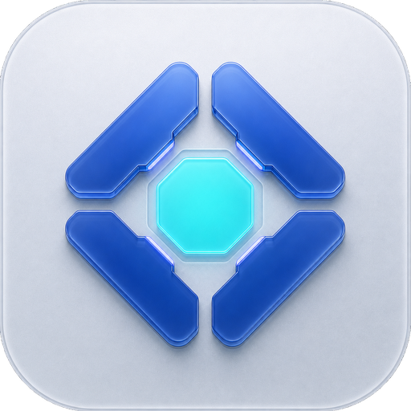

<p align="center">
  
</p>

<p align="center">
  <a href="README.md">简体中文</a> · <strong>English</strong>
</p>

<h1 align="center">AI Workbench Dashboard</h1>

<p align="center">
  Bring your local AI tools into one unified, clear, and manageable workspace.
</p>

AI Workbench Dashboard is a local monitoring and management console for AI tools. It brings OpenClaw, Codex, Claude Code, and future tools into one interface for viewing runtime status, token usage and API-equivalent cost, projects and sessions, tool calls, workspaces, scheduled tasks, and version updates.

Current local release: `v2.12.6`.

[](https://www.npmjs.com/package/ai-workbench-dashboard)
[](https://github.com/H-bai01/ai-workbench-dashboard/releases)
[](LICENSE)

> Local-first · Single user · Listens only on `127.0.0.1` by default · The browser never stores Gateway or backend secrets


## What You Can Do

- **See the whole picture:** Know which AI tools, agents, and projects are working, idle, stopped, or in an error state.
- **Understand usage:** Aggregate local token usage and API-equivalent cost, then drill down by model, project, agent, session, and time range.
- **Trace execution:** Review messages, reasoning summaries, tool calls, results, and context usage in a unified timeline and execution record.
- **Manage centrally:** Manage AI workspaces, capabilities, scheduled tasks, notifications, tool updates, and previous Workbench versions.

## Main Features

### See All AI Work in One Place

- OpenClaw is organized by agent; Codex and Claude Code are organized by project.
- Monitored objects, details, activity timeline, search, and task boards share a common structure that can support more AI tools later.
- View running, idle, stopped, and error states consistently.
- Use Today, 3 Days, 7 Days, 30 Days, This Month, Last Month, or All Time ranges.
- The main range and bottom-summary range remember your most recent selection.
- Complete statistics update once in the background, avoiding partial numbers that jump afterward.


### Monitor Token Usage

- Aggregate local token usage from OpenClaw, Codex, and Claude Code.
- Drill down by model, agent, project, session, and time.
- Review trends, model ranking, contribution ranking, and project-specific details.


### Manage Pricing Rules

- Identify input, output, and cached tokens, then calculate API-equivalent cost using model-specific pricing.
- Cost is counted only when the model is identified and a pricing rule is matched; problems appear in the notification center.

Pricing can be maintained directly in the Workbench, including input, output, cache read/write prices, and time-based discounts.


### Talk to Agents and Send Quick Messages

- View OpenClaw agent details, conversation history, model information, and context usage.
- Use the quick-message panel to select an agent, choose a reusable template, and send a message.
- The voice interface combines voice interaction, text conversation, context, and historical token information in one view.


### Manage Agent Capabilities

- Manage agent capabilities and filter them by configured, not installed, agent, and usage status.


### Manage Scheduled Tasks

- View, create, edit, pause, run immediately, and delete Cron tasks.
- Review each task's execution records, output, and result.


### Manage AI Workspaces

- Discover workspaces for OpenClaw agents, Codex, Claude Code, and future supported tools.
- Group paths by AI tool and purpose, with plain-language descriptions of what each file is for.
- View, edit, replace, delete, move, and rename supported files.
- Preview images; open videos, archives, databases, and other files with system applications.
- Add your own workspace folders manually.


### Review Projects, Sessions, and Execution

- Enter the same project scope from the pulse view, contribution ranking, or monitored-object details.
- Review user messages, AI responses, reasoning summaries, tool calls, tool results, and token records together.
- OpenClaw is viewed by agent; Codex and Claude Code are viewed by project.
- Execution records are read-only, so reviewing history cannot accidentally send a message or resume a session.
- The activity timeline combines sessions from different AI tools and supports filtering by tool, time, and session.


### Search and Customize the Workbench

- Global search can locate features, monitored AI objects, projects, sessions, and historical messages.
- Reorder page modules, top-bar controls, feature buttons, and statistics cards; the layout is remembered automatically.


### Notifications, Updates, and Version History

- The notification center keeps read history, and error notifications show time, source, error code, impact, and current result.
- Detect available OpenClaw versions and update OpenClaw from the Workbench.
- Review the changelog, historical versions, and rollback options in the Workbench.


## Quick Start

### Run Directly (Recommended)

Requires Node.js `22.13.0` or later:

```bash
npx ai-workbench-dashboard@latest
```

Then open:

```text
http://127.0.0.1:31021
```

On first launch, the Workbench creates a local Dashboard secret. The default data directory is:

```text
~/.openclaw/ai-workbench-dashboard-data
```

Press `Ctrl+C` to stop the foreground process. The npm entry point manages only the Dashboard; it does not install, stop, or restart OpenClaw Gateway.

### Install Globally

```bash
npm install --global ai-workbench-dashboard@latest
ai-workbench-dashboard start
```

### Run from Source

```bash
git clone https://github.com/H-bai01/ai-workbench-dashboard.git
cd ai-workbench-dashboard
npm ci
cp .env.example .env
npm run start:v2
```

## Supported AI Tools

| Tool | Current Capabilities |
|---|---|
| OpenClaw | Agent status, tokens, cost, sessions, execution records, capabilities, Cron, projects, file management, and version updates |
| Codex | Projects, tokens, cost, sessions, execution records, and workspace folders |
| Claude Code | Projects, tokens, cost, sessions, execution records, and workspace folders |
| Future tools | Can be integrated through the shared tool, project, session, and workspace model |

OpenClaw features require OpenClaw to be installed and running locally. When using only Codex or Claude Code, the Workbench can still read local project and session data left in the current user account.

## Configuration

See [`.env.example`](.env.example) for all available settings.

| Setting | Description |
|---|---|
| `OPENCLAW_GATEWAY_URL` | Local OpenClaw Gateway URL; loopback addresses only |
| `OPENCLAW_GATEWAY_TOKEN_FILE` | Gateway secret file; must be a regular file with `0600` permissions |
| `OPENCLAW_DASHBOARD_DATA_ROOT` | Local Dashboard data directory |
| `OPENCLAW_PUBLIC_ELECTRICITY_PER_HOUR` | Electricity price safe to expose to the browser; never place secrets here |
| `OPENCLAW_VOICE_*` | Speech recognition and text-to-speech settings |
| `OPENCLAW_DASHBOARD_TRUSTED_ORIGINS` | Additional trusted frontend origins; normally empty for local use |

Do not commit real tokens, `.env`, logs, sessions, uploads, or local configuration to the repository.

## macOS Install, Upgrade, Rollback, and Uninstall

For login launch, keeping older versions, and health-check rollback, see:

- [macOS lifecycle tools](docs/macos-lifecycle.md)

These tools manage only the Dashboard and never restart or take over OpenClaw Gateway.

## Security Boundaries

- Frontend and backend listen only on `127.0.0.1` by default.
- The browser does not store Gateway or Dashboard tokens.
- Local secrets are used through a protected same-origin relay.
- File operations are limited to confirmed AI workspaces or folders manually added by the user.
- Paths, symlinks, origins, content, and avatar URLs are validated.
- Public tests never read the real HOME, real sessions, or a real Gateway.
- Remote access, ngrok, HTTPS wrappers, and Windows control entry points are disabled by default.

## Current Limitations

- This is currently a local-first, single-user product and is not designed for public-network or multi-user deployment.
- Execution records are read-only; Codex and Claude Code sessions cannot yet be resumed, stopped, or continued from one shared interface.
- The Workbench shows only reasoning or summaries actually recorded by the client; it does not infer hidden content.
- Some model prices must be maintained in Billing Settings; unidentified models produce an explicit error.
- Voice conversation remains an experimental feature.

## Development and Testing

```bash
npm run test:unit
npm run test:security
npm run build
npm run lint:check -- --quiet
npm run scan:secrets
```

Tests requiring a real Gateway or real sessions are explicit local acceptance steps and are not run in public CI.

## License and Third-Party Notices

Code released by the project rights holder is available under the [MIT License](LICENSE). Third-party code, names, trademarks, and other assets remain subject to their respective licenses and rights policies.

- [Source provenance](SOURCE_PROVENANCE.md)
- [Third-party notices](THIRD_PARTY_NOTICES.md)
- [Trademark notice](TRADEMARKS.md)
- [Public snapshot boundary](PUBLIC_SNAPSHOT.md)
- [Public file manifest](PUBLIC_FILES.txt)
- [File checksums](SHA256SUMS.txt)
